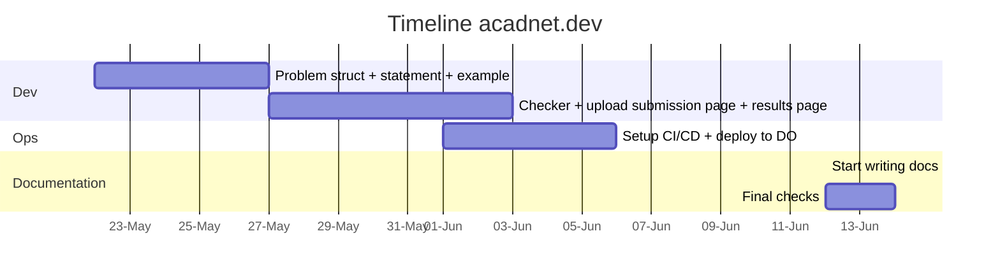

# Documentation for acadnet.dev project
This repo is a starting point for writing my diploma thesis. It contains all the documentation for the project.

## Project idea
To better understand the idea behind the project please start with the [user journey](docs/user-journey.md). You should also check the [software architecture](docs/software-architecture.md) stack.

## Docs
* [User journey](docs/user-journey.md) - describes the user journey through the app
* [Software architecture](docs/software-architecture.md) - describes the software architecture of the app

## Timeline

## How to edit the docs
* To edit the diagrams you need to install this vscode extension: [Draw.io Integration](https://marketplace.visualstudio.com/items?itemName=hediet.vscode-drawio)