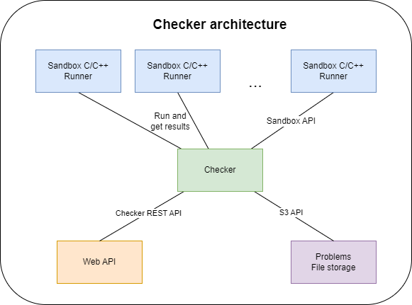

# How does the checker work?
The checker is written in Rust and has multiple components described below.

## Checker architecture diagram

# Retrieving submissions and returning results
## API server
The base component for the checker is a REST API server. It is responsible for receiving requests from the client (Web API) that manage creating, running and retrieving results from submissions. You can find the API documentation [here](checker-api.md).

# Building the uploaded submission code
## Build server
The checker is also responsible for building a static executable from the user uploaded code.

# Running the submission
## Sandbox manager
The checker also comes with a manager of custom created sandbox images that are used to run the submissions. The manager is responsible for creating, deleting and updating the containers. It also provides a way to run the sandbox image and retrieve the results.

## Sandbox image
The image is a simple UNIX system that exposes a REST Api for uploading, running binaries and retrieving results.