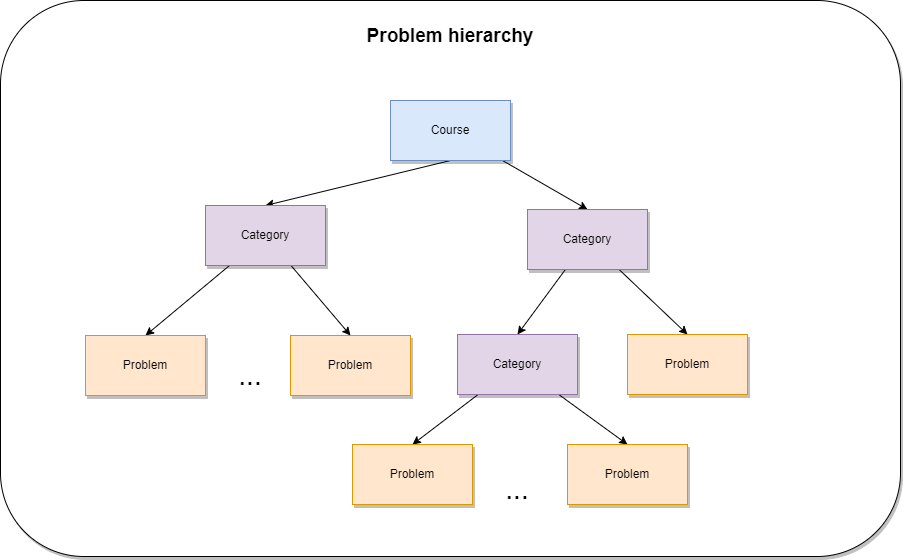

# Problem hierarchy

## Hierarchy concept

The problem hierarchy is structured from multiple courses. Each course has variable number of categories and subcategory. And each category can have problems or other categories as children.

This way we can have a custom dynamic problem hierarchy like in the diagram below.

## Layout diagram

