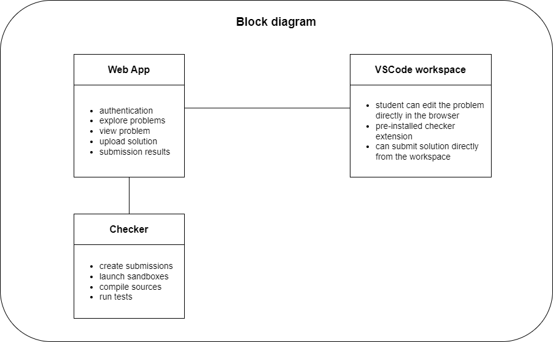

# Software architecture

## Block diagram

## Software architecture

# Components
## Web UI
.NET 7 MVC app that serves the main web UI.

Responsibilities:
* User authentication
* User registration
* Problem listing
* Problem statement viewing
* Download of problem sources
* Upload of problem solutions
* Access to VSCode Workspace
* Problem results viewing

## PostgreSQL
PostgreSQL database that stores all the structured data.

Main entities stored:
* Users
* Problems
* Submissions
* Stats

## Checker
TBD

## Problems file storage
TBD

## VSCode Workspaces
TBD