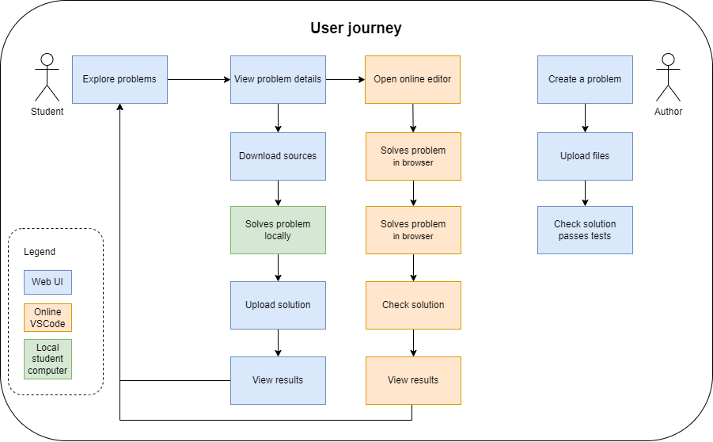

# User journey

## Diagram

## Description
The user is presented with a login screen. They can login with their Google account or other authenthication providers. The user can then explore problem sets and choose a problem they want to solve. They have to choose if they want to solve the problem locally or in an online VSCode workspace.

### Solving the problem locally
If the user chooses to solve the problem locally, they are presented with a screen where they can download the problem files. The user can then open the problem files in their preffered IDE and solve the problem. When they are done, they can upload the solution files and their sources will be checked and the user will be presented with results.

### Solving the problem in an online VSCode workspace
If the user chooses to solve the problem in an online VSCode workspace, they are presented with a screen where they can open the problem files in a presonal VSCode workspace. The user can then solve the problem in the VSCode workspace. When they are done, the already installed VSCode extension can be used to directly check the solution. The results are then presented to the user.

## Notes about the online VSCode workspace
* The user files are persistent. The user can come back to the workspace at any time and continue working on any problem.
* The user will have 50MB of storage for their source code files. This is enough for at least 1000 problems.